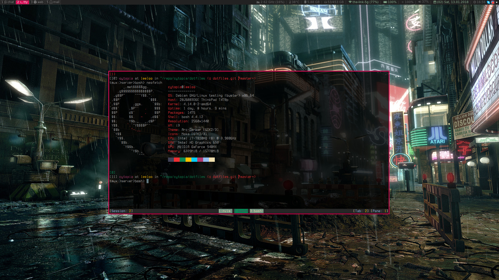
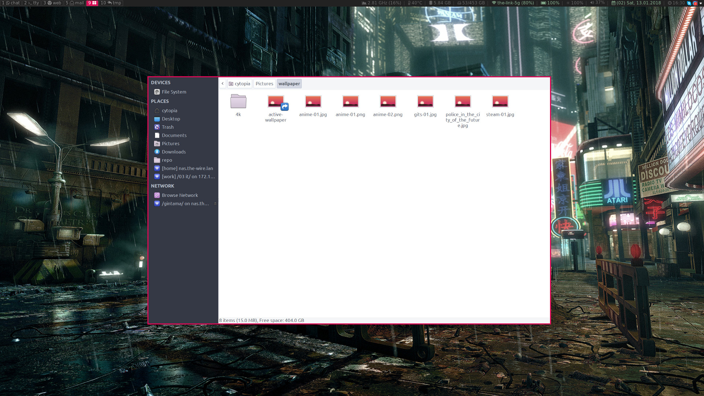
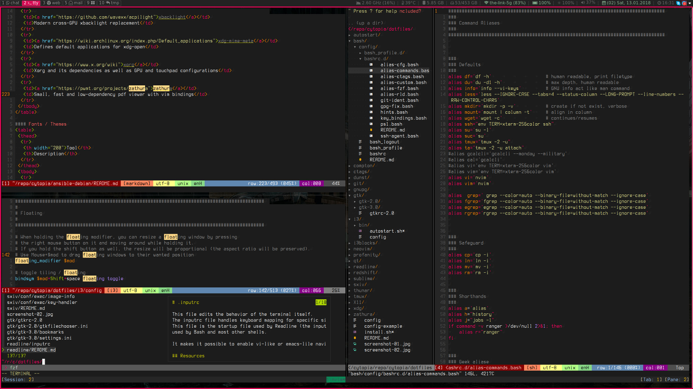
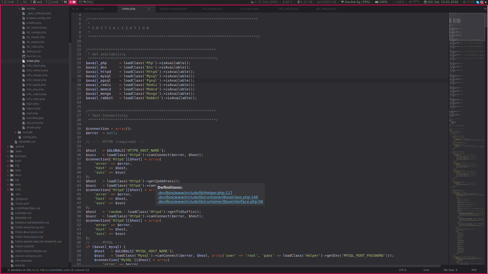
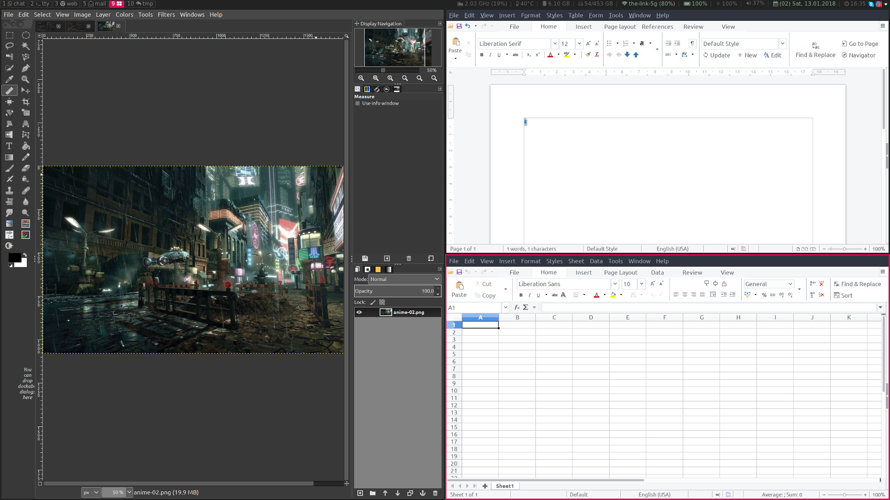

# dotfiles

**[TL;DR](#tldr)** | 
**[What is included?](#what-is-included)** | 
**[How to apply?](#how-to-apply)** | 
**[Screenshots](#screenshots)**

These are all of my personal hand-crafted and non-bloated dotfiles I use at home as well as at work.

Before applying my dotfiles on an untouched system, I provision it in one go with **[ansible-debian](https://github.com/cytopia/ansible-debian)**.


## TL;DR
```bash
$ ./install.sh
```


## What is included?

| dotfile   | description |
|-----------|-------------|
| bash      | Shell configuration files |
| compton   | Compositor for Xorg |
| ctags     | Generate tag files for source code. Integrates well into vim and neovim |
| dunst     | Notification manager for i3-wm |
| git       | gitconfig |
| gnupg     | gnupg configuration |
| gtk       | GTK 2.0 and GTK 3.0 theme configuration |
| i3        | i3 / i3-gaps configuration |
| i3blocks  | i3blocks (status bar for i3) configuration |
| neovim    | The last editor |
| profanity | Console based XMPP client |
| qt        | QT theme configuration |
| readline  | Terminal key configuration |
| redshift  | Turns the screen red when working during night. Keeps your eyes intact |
| sublime   | Fast gui-based editor |
| sxiv      | Small, fast and low-dependency image viewer with vim binding |
| thunar    | Gui-based and leight-weight file explorer |
| tmux      | Terminal multiplexer |
| X11       | X11 configuration files (Xresources, Xmodmap, xinitrc and xsession).<br/> They also configure dpi, fonts, colors, rofi and urxvt |
| xdg       | Sets my prefered default applications |
| zathura   | Small, fast and low-dependency pdf viewer with vim bindings |


## How to apply?
Running `install.sh` will just symlink every configuration file from this repository to its respective location. Before doing so it will take care about confirmation and backups.

1. Each symlink must be confirmed and can be skipped
2. Backing up the currently existing config file to `~/dotfiles-backup_<YYY-MM-DD_hh_mm_ss>/`

```bash
# Install with confirmation
$ ./install.sh

Symlink bash? (Y/n)
Symlink compton? (Y/n)
Symlink ctags? (Y/n)
Symlink dunst? (Y/n)
...
```

You can also run everything without confirmation by supplying `-y` argument to the `install.sh` script.
```bash
# Install without confirmation and always assume yes
$ ./install.sh -y
```


## Screenshots

#### Rofi
[](screenshot-01.jpg)

#### urxvt
[](screenshot-02.jpg)

#### Thunar
[](screenshot-03.jpg)

#### Neovim
[](screenshot-04.jpg)

#### Sublime Text 3
[](screenshot-05.jpg)

#### Gimp & LibreOffice
[](screenshot-06.jpg)
